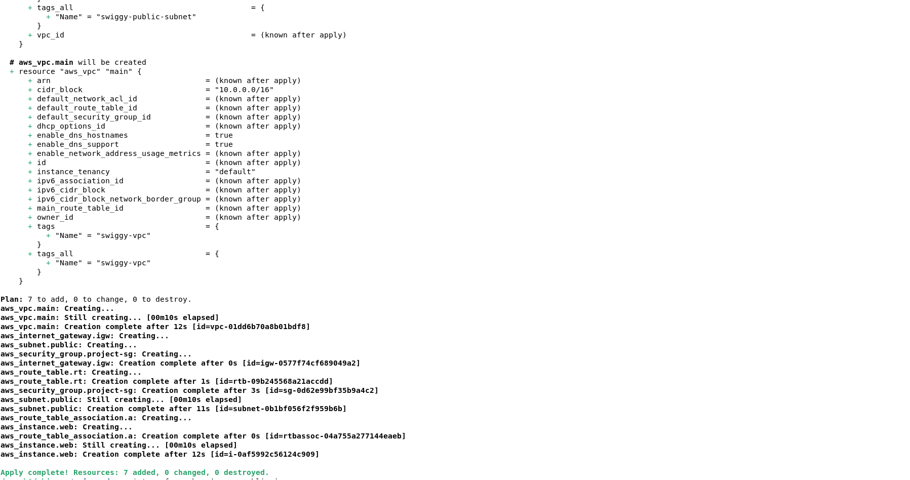
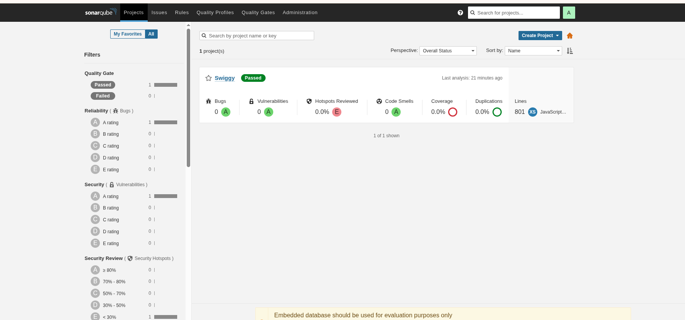
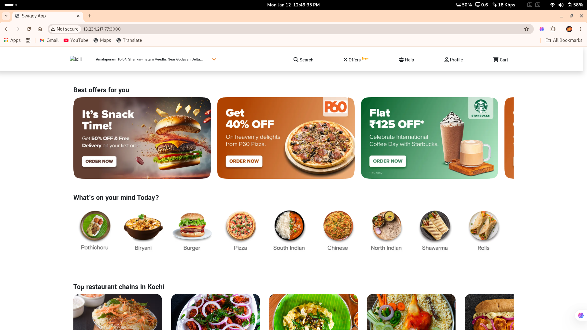

# 🍱 Swiggy DevSecOps Project: End-to-End Automation

Welcome to my Swiggy-Clone DevOps project. This isn't just a simple deployment; it's a full-scale DevSecOps pipeline where I provisioned cloud infrastructure, secured the code, and automated the delivery using industry-standard tools.

---

## 🚀 The Mission
The goal was to take a React-based Swiggy clone and move it from local development to a production-ready AWS environment with zero manual intervention after the initial setup.

## 🛠️ Phase 1: Infrastructure & Environment Setup

### 1. Cloud Provisioning (Terraform)
I didn't manually click through the AWS console. I used **Terraform** to create:
* A custom VPC with Public Subnets.
* Security Groups allowing traffic on ports 8080 (Jenkins), 9000 (Sonar), 3000 (App), and 22 (SSH).
* An EC2 instance (Ubuntu) to host our entire stack.

**Proof of Infrastructure:**

### 2. The Server "Hardening"
Once the server was up, I manually handled these critical configurations to make the pipeline possible:
* **Docker Permissions:** By default, Jenkins cannot talk to Docker. I resolved this by adding the Jenkins user to the Docker group:
  `sudo usermod -aG docker jenkins`
* **Disk Expansion (Real-World Troubleshooting):** During the build, the 8GB disk filled up. I expanded the EBS volume in AWS to 16GB and manually resized the partition using `growpart` and `resize2fs` to keep the project alive.

---

## 🏗️ Phase 2: The CI/CD Engine (Jenkins)

### Jenkins Configuration
I set up the Jenkins Master with the following tools installed under **Manage Jenkins > Tools**:
1. **JDK 17:** Required to run Jenkins and SonarQube.
2. **Node.js 16:** Necessary to compile the React frontend.
3. **SonarQube Scanner:** To send our code for analysis.

### The Pipeline Logic
I wrote a `Jenkinsfile` that executes these specific stages:
* **Clean Workspace:** Starting every build with a fresh slate.
* **Sonarqube Analysis:** Scanning for "Code Smells" and security vulnerabilities.
* **Trivy File Scan:** Checking the filesystem for known CVEs before we ever build a container.
* **Docker Build & Deploy:** Building the `swiggy-image` and launching it as a container named `swiggy-app`.

**My Jenkins Pipeline in Action:**

---

## 🛡️ Phase 3: Security & Code Quality

### SonarQube Setup
I configured a SonarQube Server on Port 9000 and generated a unique **Security Token**. This allows Jenkins to securely "talk" to SonarQube and report back if the code is safe to deploy.

**SonarQube Quality Gate Pass:**

### Container Security (Trivy)
Before the app goes live, **Trivy** scans the code. If it finds critical vulnerabilities, we know about it immediately in the Jenkins logs.

---

## 🌐 Phase 4: Final Result
The application is containerized and running smoothly on AWS. You can access the live food delivery interface by visiting the server's public IP on port 3000.

**The Live Application:**

---

## 🧠 Key Takeaways & Skills
* **Problem Solving:** Fixed "Permission Denied" and "Out of Disk Space" errors on a live Linux server.
* **Tool Chain:** Expertly connected Git -> Jenkins -> SonarQube -> Docker.
* **Visualization:** Implemented **Portainer** for a browser-based view of my running containers.
